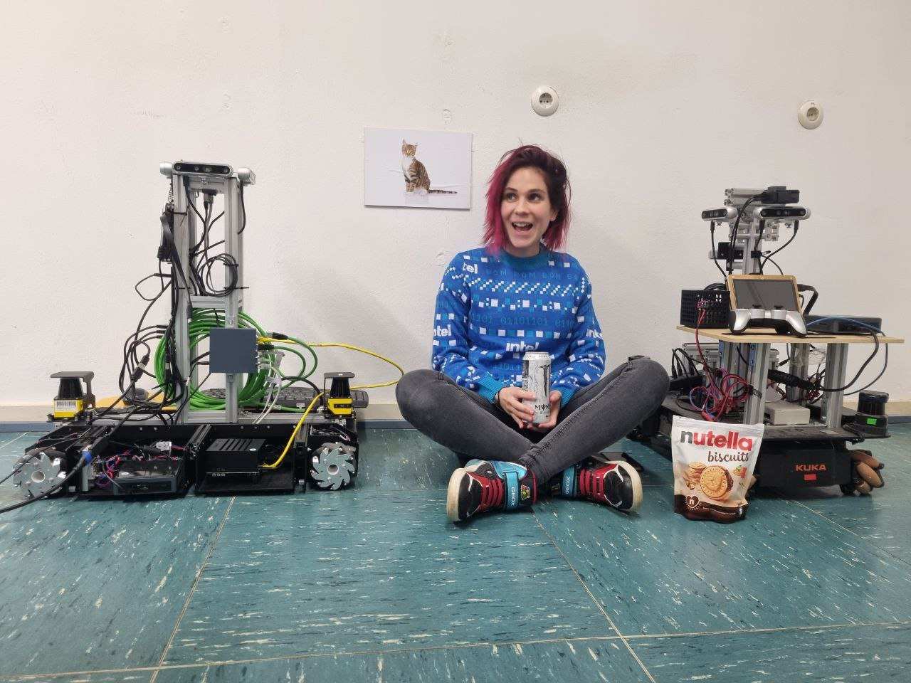

# About
I am currently a Postdoctoral Research Fellow in National University of Singapore working with Prof. [David Hsu](https://www.comp.nus.edu.sg/~dyhsu/). 
I graduated as a PhD in Computer Science from Università della Svizzera italiana in 2024, where I also completed my MSc. 
Previously, I worked for General Motors and Intel. 

Research Keywords: Localization, Mapping, Open World Navigation

<!-- -->

# Publications
First authors in bold:
* **Ayush Agrawal**, **Joel Loo**, **Nicky Zimmerman**, David Hsu “Sign Language: Towards Sign Understanding for Robot Autonomy”, under review for IEEE International Conference on Robotics and Automation (ICRA) 2026
* **Nicky Zimmerman**, Joel Loo, Ayush Agrawal, David Hsu, “SignLoc: Robust Localization using Navigation Signs and Public Maps”, under review for IEEE Robotics and Automation Letters 
* **Nicky Zimmerman**, Alessandro Giusti, Jérôme Guzzi “Resource-Aware Collaborative Monte Carlo Localization with Distribution Compression”, IEEE/RSJ International Conference on Intelligent Robots and Systems (IROS) 2024
* **Julian Moosmann**, **Hanna Müller**, **Nicky Zimmerman**, Georg Rutishauser, Luca Benini, Michele Magno, “Flexible and Fully Quantized Lightweight TinyissimoYOLO for Ultra-Low-Power Edge Systems”, IEEE Access 2024
* **Nicky Zimmerman**, **Hanna Müller**, Michele Magno, Luca Benini “Fully Onboard Low-Power Localization with Semantic Sensor Fusion on a Nano-UAV using Floor Plans”, IEEE International Conference on Robotics and Automation (ICRA) 2024
* **Nicky Zimmerman**, **Matteo Sodano**, Elias Marks, Jens Behley, Cyrill Stachniss “Constructing Metric-Semantic Maps using Floor Plan Priors for Long-Term Indoor Localization”, IEEE/RSJ International Conference on Intelligent Robots and Systems (IROS) 2023 
* **Hanna Müller**, **Nicky Zimmerman**, Tommaso Polonelli, Michele Magno, Jens Behley, Cyrill Stachniss, Luca Benini “Fully On-board Low-Power Localization with Multizone Time-of-Flight Sensors on Nano-UAVs”, Design, Automation & Test in Europe Conference & Exhibition (DATE) 2023 
* **Nicky Zimmerman**, Tiziano Guadagnino, Xieyuanli Chen, Jens Behley, Cyrill Stachniss “Long-Term Localization Using Semantic Cues in Floor Plan Maps”, IEEE Robotics and Automation Letters 2023 
* **Haofei Kuang**, Xieyuanli Chen, Tiziano Guadagnino, Nicky Zimmerman, Jens Behley, Cyrill Stachniss “IR-MCL: Implicit Representation-Based Online Global Localization”, IEEE Robotics and Automation Letters 2023 
* **Louis Wiesmann**, Tiziano Guadagnino, Ignacio Vizzo, Nicky Zimmerman, Yue Pan, Haofei Kuang, Jens Behley, Cyrill Stachniss “LocNDF: Neural Distance Field Mapping for Robot Localization”, IEEE Robotics and Automation Letters 2023 
* **Nicky Zimmerman**, Louis Wiesmann, Tiziano Guadagnino, Thomas Läbe, Jens Behley, Cyrill Stachniss “Robust Onboard Localization in Changing Environments Exploiting Text Spotting”, IEEE/RSJ International Conference on Intelligent Robots and Systems (IROS) 2022  
* **Daniele Palossi**, Nicky Zimmerman, Alessio Burrello, Francesco Conti, Hanna Müller, Luca Maria Gambardella, Luca Benini, Alessandro Giusti, Jérôme Guzzi “Fully Onboard AI-Powered Human-Drone Pose Estimation on Ultralow-Power Autonomous Flying Nano-UAVs” IEEE Internet of Things Journal 2021
* **Elia Cereda**, Marco Ferri, Dario Mantegazza, Nicky Zimmerman, Luca M Gambardella, Jérôme Guzzi, Alessandro Giusti, Daniele Palossi “Improving the Generalization Capability of DNNs for Ultra-Low Power Autonomous Nano-UAVs”, International Conference on Distributed Computing in Sensor Systems 2021

# Professional Activities
Workshop Organizer: IROS 2025

Journal Reviewer: RAL, IoT-J

Conference Reviewer: ICRA, IROS
